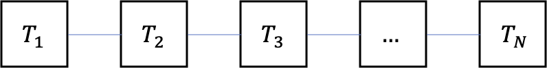
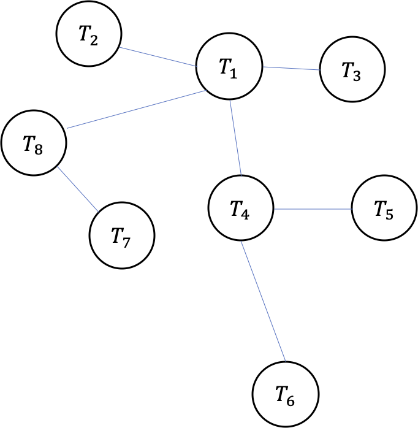

#### TODOs

* ~~补充Laplacian谱分解内容以及物理意义~~
* ~~关于局部子图分解GCN内容~~
* replace mod.deep_learning_relevant with mod.neural_network
   * more generalized classes and methods

### 一、背景介绍

GCN是一种基于图网络结构的神经网络，在对GCN进行介绍前，定义几个关键矩阵如下：

**邻接矩阵（Adjacency Matrix）**:

$$
\textbf{A} = \left[
\begin{aligned}
	\begin{array}{c}
	a_{1,1}, a_{1, 2}, ...,a_{1,N} \\
	a_{2,1}, a_{2, 2}, ...,a_{2,N} \\
	... \\
	a_{N,1}, a_{N, 2}, ...,a_{N,N} \\
	\end{array}
\end{aligned}
\right]
$$

其中：

$$
a_{i,j} =
\left\{
\begin{aligned}
&1, \text{ if element } i \text{ connet to } j \\
&0, \text{ else}
\end{aligned}
\right.
$$

**度矩阵（Degree Matrix）**：

$$
\textbf{D} = \left[
	\begin{array}{c}
	d_{1,1}, 0, ...,0 \\
	0, d_{2, 2}, ...,0 \\
	... \\
	0, 0, ...,d_{N,N} \\
	\end{array}
\right]
$$

对角主元值表示对应变量的连出度数：

$$
d_{i,i} = \text{number of connections starting from } i
$$

度矩阵与邻接矩阵的关系为：

$$
d_{i,i} = \sum_j a_{i,j}
$$

**拉普拉斯矩阵（Laplacian Matrix）**：

$$
\textbf{L} = \textbf{D} - \textbf{A} = \left[
	\begin{array}{c}
	d_{1,1}, -a_{1,2}, ...,-a_{1,N} \\
	-a_{2,1}, d_{2, 2}, ...,-a_{2,N} \\
	... \\
	-a_{N,1}, -a_{N,2}, ...,d_{N,N} \\
	\end{array}
\right]
$$

***

### 二、GCN的物理意义：热传导模型

类比一维和二维平面上的传热模型：

一维传热：

第$i$个单元与其周边$i-1$、$i+1$单元传热方程为：

$$
\frac{\mathrm{d} T_i}{\mathrm{d} t} = k(T_{i+1} - T_i) + k(T_{i-1} - T_i)
$$

其中$k$为一常数，与传热系数、比热容有关。当两个单元距离非常近时，上式可进一步改写为：

$$
\begin{aligned}\frac{\partial T_i}{\partial t} &= k(T_{i+1} - T_i) - k(T_{i} - T_{i-1}) \\&= k \cdot \mathrm{d} x \left(\frac{\partial T}{\partial x}|_{x = i + 1} - \frac{\partial T}{\partial x}|_{x = i}  \right) \\&= k \cdot \mathrm{d}x^2 \frac{\partial^2 T}{\partial x^2}|_{x = i} \\&= \tilde k \cdot \frac{\partial^2 T}{\partial x^2}|_{x = i} \\&= \tilde k \cdot \nabla^2 T\end{aligned}
$$

其中$\nabla^2$被称为Laplacian算子。这个式子告诉我们，某点温度升高的速度正比于该点周围的温度场空间分布的二阶梯度，使用Laplacian算子衡量。

同样地，可以将该传热模型在图网络上进行类比推广：

在图网络上，第$i$个单元与其周围单元传热方程为：

$$
\frac{\mathrm{d}T_i}{\mathrm{d}t} = k \sum_j \textbf A_{i,j} (T_j - T_i)
$$

其中$\textbf A$即为前文中的邻接矩阵，这一步计算相当于将第$i$个单元周围所有邻接单元的温度信息进行了一次“卷积”计算。

上式可以进一步写作：

$$
\begin{aligned}\frac{\mathrm{d}T_i}{\mathrm{d}t} &= k [ \sum_j \textbf A_{i,j} T_j - \sum_j \textbf A_{i,j} T_i ] \\& = k[ \sum_j \textbf A_{i,j} T_j - \textbf D_{i,i} T_i ]\end{aligned}
$$

式中$\textbf D$即为前文中的（连出）度矩阵。这只是对单元$i$温度的更新，考虑到整个图网络上所有单元，有：

$$
\left[\begin{array}{c}\frac{\mathrm{d}T_1}{\mathrm{d}t} \\ \frac{\mathrm{d}T_2}{\mathrm{d}t} \\... \\ \frac{\mathrm{d}T_N}{\mathrm{d}t} \\ \end{array}\right]=k \textbf A \left[\begin{array}{c}T_1 \\T_2 \\... \\T_N \\\end{array}\right] - k \left[\begin{array}{c}\textbf D_{0, 0} \times T_1 \\\textbf D_{1, 1} \times T_2\\... \\ \textbf D_{N, N} \times T_N\\\end{array}\right]
$$

这便是热传导网络在该图网络上的一次前向计算。定义$T = [T_1, T_2, ..., T_N]$，有：

$$
\begin{aligned} \frac{\mathrm{d}T}{\mathrm{d}t} &= k\textbf A \cdot T - k \textbf D \cdot T \\&= -k(\textbf D - \textbf A) \cdot T \\& = -k \textbf L \cdot T\end{aligned}
$$

其中$\textbf L$即为Laplacian矩阵。至此，我们已经获得了图网络上热传导的前向计算公式，只要我们获得了图上单元间的传热系数$k$、图网络结构Laplacian矩阵$L$以及此刻各单元上的温度分布$T$，便可对之后的热传导进行迭代计算。

***

### 三、GCN应用

GCN实际应用时可对第二节中的模型进行如下类比：

* $\textbf L$ $\rightarrow$  不仅考虑一阶近邻，还可以考虑高阶近邻关系
* 单元温度$T$ $\rightarrow$ 节点特征$X$
* 传热系数$k$ $\rightarrow$ 神经网络参数$W, b$等

我们可以采集特征$X$在一定时期变化的样本，以$X_t$和$X_{t+1}$的形式输入到GCN中作为输入和输出样本，反向回归出神经网络参数$W$和$b$等。

实际过程中，对Laplacian矩阵也有不同的处理：

采用对称归一化Laplacian矩阵的GCN前向计算公式如下：

$$
X^{l+1} = \sigma \left(\textbf L X^l W^l \right)= \sigma \left(\textbf{D}^{-1/2} \tilde{\textbf{A}} \textbf{D}^{-1/2} X^l W^l \right)
$$

其中：

* $X^l$、$X^{l+1}$：第$l$和第$l+1$层隐含层
* $\sigma$：激活函数
* $\textbf{D}$：度矩阵
* $\tilde{\textbf{A}}$：$\textbf{A}+\textbf{I}$，其中$\textbf{A}$为邻接矩阵，$\textbf{I}$为单位矩阵
* $W^l$：待学习权重参数

通过以上分析易有，Laplacian矩阵$\textbf L$为对称半正定矩阵，则$\textbf L$一定可以被进行如下分解：

$$
\textbf L = \textbf U \left(\begin{array}{c}\lambda_1 &&\\&\ddots& \\&&\lambda_N \\\end{array}\right) \textbf U^{-1}
$$

其中$\textbf U$为正交矩阵，$\textbf U \textbf U^T = \textbf I$，则有：

$$
\textbf L = \textbf U \left(\begin{array}{c}\lambda_1 &&\\&\ddots& \\&&\lambda_N \\\end{array}\right) \textbf U^T
$$

得到前向计算式：

$$
\textbf L X^l = \textbf U \left(\begin{array}{c}\lambda_1 &&\\&\ddots& \\&&\lambda_N \\\end{array}\right) \textbf U^T X^l
$$

该式不适合大图的计算，因为特征向量矩阵$\textbf U$的复杂度为$O(N^2)$，而且对大图的$\textbf L$矩阵进行谱分解的计算量也很大。针对这些问题，不断有文章进行改进，请参见后文中的参考文献。

***

### 四、GCN实现

GCN的实现可以参考文献5中相关内容，这里仅作简要总结。

首先定义一个图网络$G = (u,V,E)$，其中$u$为该图网络的全局属性；$V$是节点集；$E$为节点间连边集，$E = \{(e_k,s_k,r_k)\}_{k=1,\cdots,N_e}$，$e_k,s_k,r_k$分别表示边$E_k$的特征、起始节点编号和终止节点编号。

***

#### References

1. Bruna, Joan, et al: ***Spectral Networks and Locally connected Networks on Graphs***.
2. Defferrard, Michaël, Xavier Bresson, Pierre Vandergheynst: ***Convolutional Neural Networks on Graphs with Fast Localized Spectral Filtering***.
3. Hammond, K. David, Pierre Vandergheynst, Rémi Gribonval: ***Wavelets on graphs via spectral graph theory***.
4. Kipf, N. Thomas, Max Welling: ***Semi-supervised Classification with Graph Convolutional Networks***.
5. P. W. Battaglia, et al: ***Relational Inductive Biases, Deep Learning, and Graph Networks***.

