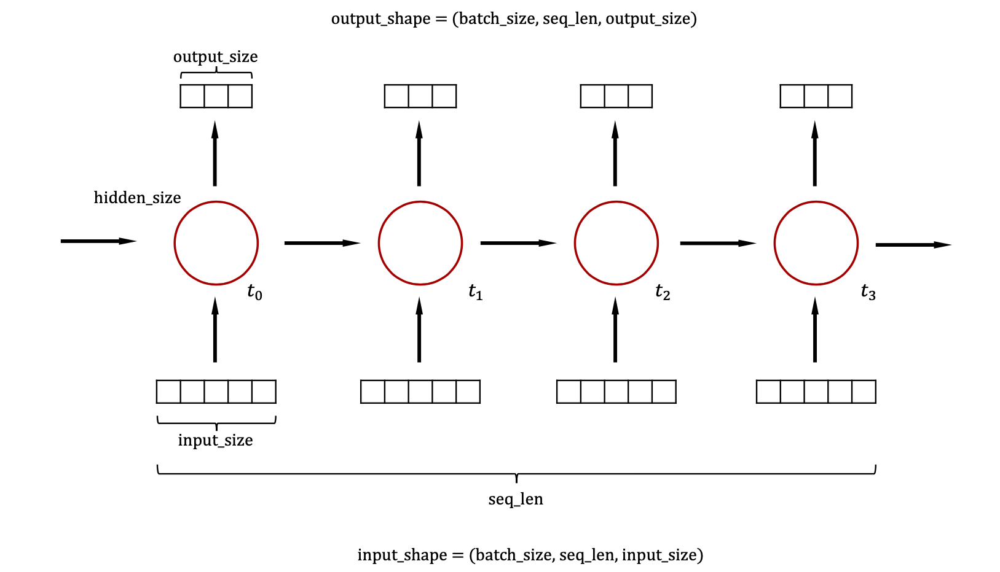
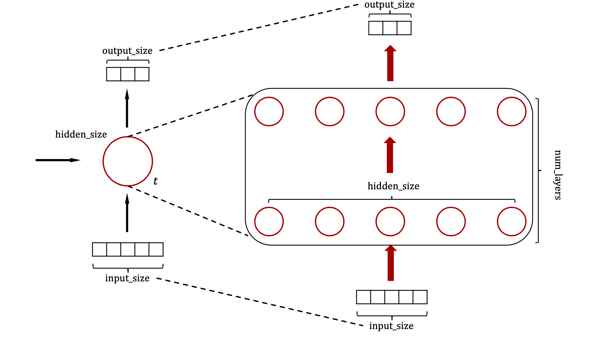

## Notes

#### LSTM in Pytorch:

LSTM对象：

```python
from torch import nn
lstm = nn.LSTM(input_size, hidden_size, num_layers, bias, batch_first, dropout, bidirectional)
```

对应输入x的shape为：

```python
x.shape = (batch_size, seq_len, input_size)
```

各参数意义如下图所示：





前向计算为:

```python
x_out, (h_out, c_out) = lstm(x_in, (h_in, c_in))
```

其中：

```python
h_in.shape = h_out.shape = (num_layers, batch_size, hidden_size)
c_in.shape = c_out.shape = (num_layers, batch_size, hidden_size)
```

